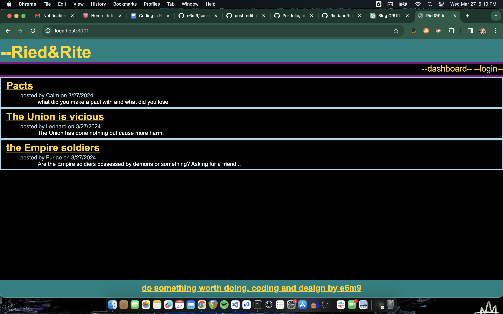
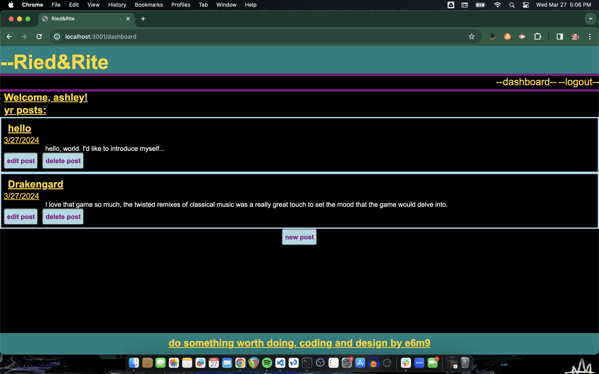
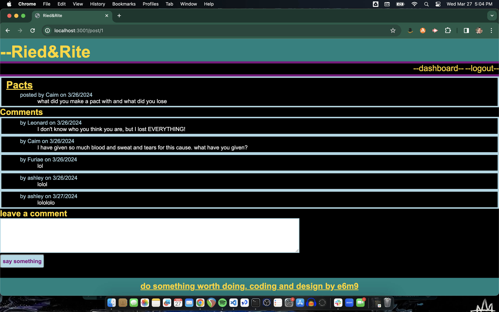

# Ried&Rite
<svg xmlns="http://www.w3.org/2000/svg" xmlns:xlink="http://www.w3.org/1999/xlink" width="122" height="20" role="img" aria-label="license: MIT License"><title>license: MIT License</title><linearGradient id="s" x2="0" y2="100%"><stop offset="0" stop-color="#bbb" stop-opacity=".1"/><stop offset="1" stop-opacity=".1"/></linearGradient><clipPath id="r"><rect width="122" height="20" rx="3" fill="#fff"/></clipPath><g clip-path="url(#r)"><rect width="47" height="20" fill="#555"/><rect x="47" width="75" height="20" fill="#008080"/><rect width="122" height="20" fill="url(#s)"/></g><g fill="#fff" text-anchor="middle" font-family="Verdana,Geneva,DejaVu Sans,sans-serif" text-rendering="geometricPrecision" font-size="110"><text aria-hidden="true" x="245" y="150" fill="#010101" fill-opacity=".3" transform="scale(.1)" textLength="370">license</text><text x="245" y="140" transform="scale(.1)" fill="#fff" textLength="370">license</text><text aria-hidden="true" x="835" y="150" fill="#010101" fill-opacity=".3" transform="scale(.1)" textLength="650">MIT License</text><text x="835" y="140" transform="scale(.1)" fill="#fff" textLength="650">MIT License</text></g></svg>

## Description
a cms style blog site

## Table of Contents
- [Installation](#installation)
- [Usage](#usage)
- [Tests](#tests)
- [License](#license)
- [Acknowledgements](#acknowledgements)
- [Further-Development](#further-development)
- [Contact](#contact)
- [Final-Thoughts](#final-thoughts)

## Installation

## Usage
sign up to create an account to make, edit, and delete posts or comment on other postposts.

[link-to-deployed-application](https://morning-eyrie-69746-22e0c570d180.herokuapp.com/)

## Tests

## License
MIT License
Use the following link to learn more about the license: (https://opensource.org/license/mit/)

## Acknowledgements
This application utilizes the following packages along with chatgpt as a debugging tool:

- [https://expressjs.com/](Express.js)
- [https://www.npmjs.com/package/express-handlebars](express-handlebars)
- [https://www.npmjs.com/package/mysql2](mysql2)
- [https://www.npmjs.com/package/sequelize](sequelize)
- [https://www.npmjs.com/package/dotenv](dotenv)
- [https://www.npmjs.com/package/bcrypt](bcrypt)
- [https://www.npmjs.com/package/express-session](express-session)
- [https://www.npmjs.com/package/connect-session-sequelize](connect-session-sequelize)

## Further Development

## Contact
Author:
  [e6m9 on GitHub](https://github.com/e6m9)

Please send any questions or concerns to:
  alostsound@gmail.com

## Final Thoughts

This was a really fun and satisfying project to work on despite the many many difficulties I had building it.
